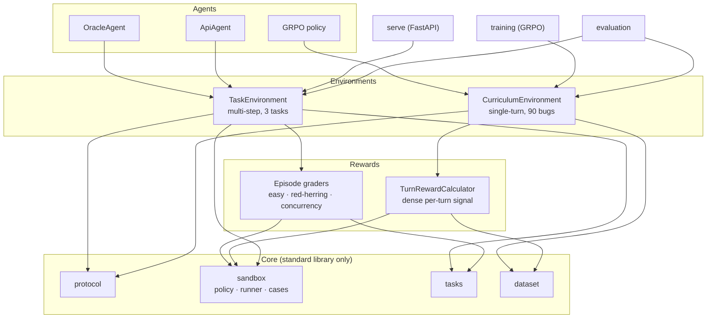
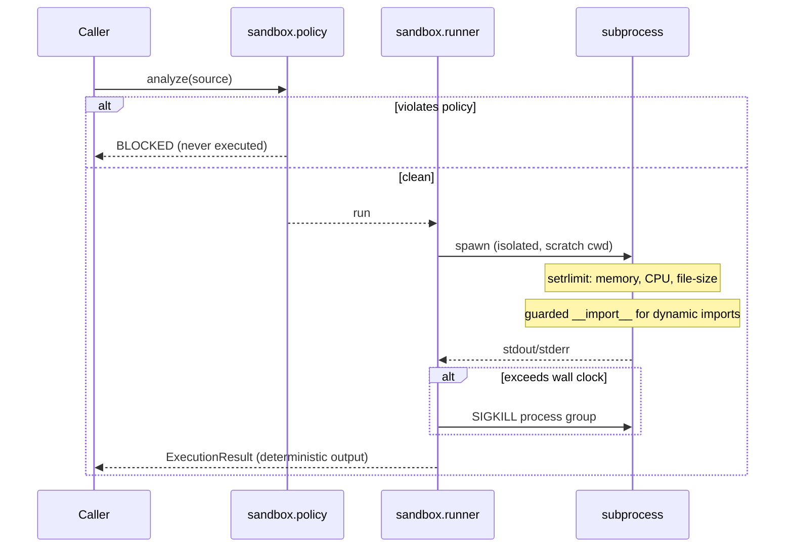

# Architecture

AgentDebuggerEnv is layered so that every path to "did this fix work?" runs
through the same sandbox and the same test runner. The environments, the reward
function, the graders and the dataset validator are all clients of that core;
none of them executes code themselves.

## The layers



## Modules

| Module | Responsibility | Depends on |
| --- | --- | --- |
| `config` | Sandbox limits and the curriculum schedule | — |
| `protocol` | Actions, observations, structured-response parsing | — |
| `sandbox` | Static policy, resource-limited runner, test-case runner | `config` |
| `tasks` | The three hand-written tasks and their test harness | `config`, `sandbox` |
| `dataset` | The 90-bug tiered dataset, loader, and execution validator | `config`, `sandbox` |
| `rewards` | Dense turn reward (training) and episode graders (tasks) | `protocol`, `sandbox`, `tasks` |
| `envs` | `TaskEnvironment` and `CurriculumEnvironment` | `protocol`, `rewards`, `sandbox`, `tasks`, `dataset` |
| `agents` | Oracle (offline) and API (OpenAI-compatible) agents | `protocol`, `tasks` |
| `evaluation` | Episode and curriculum evaluation, with JSON reports | `envs`, `agents` |
| `training` | GRPO trainer, prompts, hardware-scaled batch geometry | `envs`, `dataset` |
| `serve` | FastAPI server over the multi-step environment | `envs`, `tasks` |
| `cli` | The `agentdebugger` command | everything above |

The dependency graph is acyclic and points inward: the core knows nothing about
the environments, the environments know nothing about the server or trainer. That
is why `import agentdebugger` needs only the standard library — the heavy
dependencies (`torch`, `fastapi`) are imported lazily inside `training` and
`serve`.

## The sandbox, in detail



## Editing the diagrams

The Mermaid diagrams above are the source of truth and render on GitHub
directly. To edit one, change the fenced ```mermaid``` block; to export it to
SVG or PNG, paste it into the [Mermaid live editor](https://mermaid.live) or
open the file in any Mermaid-aware editor (Excalidraw, VS Code, Obsidian all
import Mermaid).
